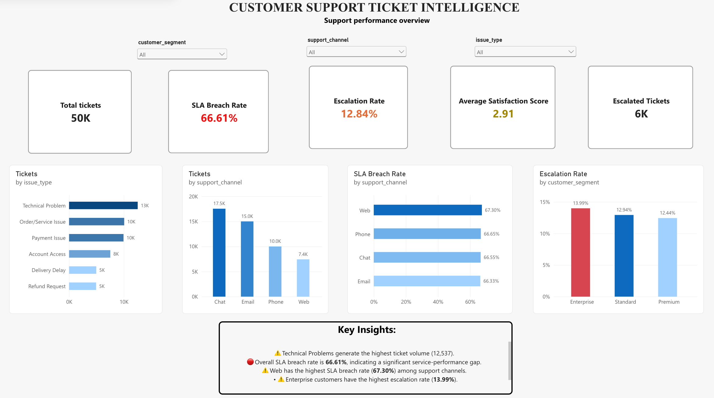
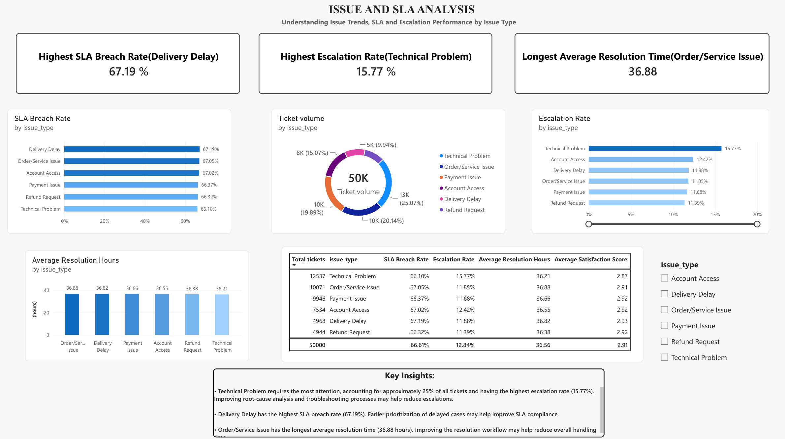
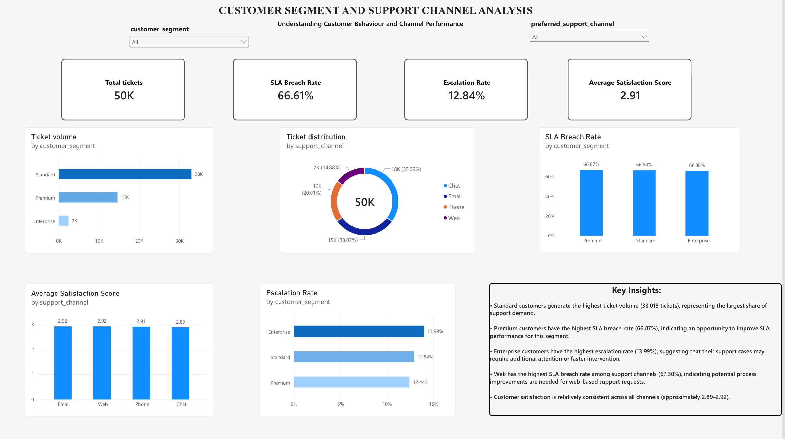
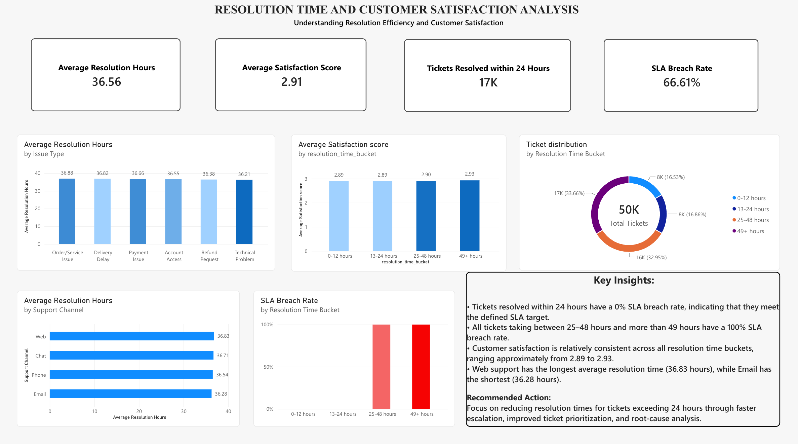
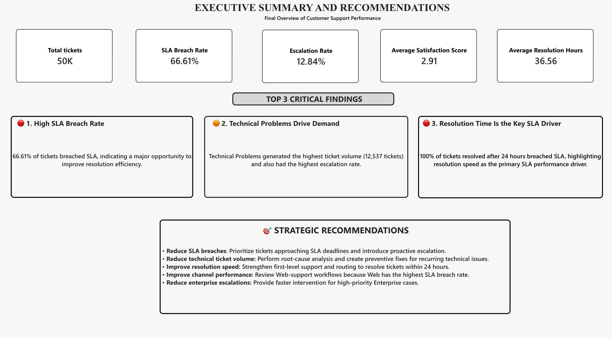

# Customer Support Ticket Intelligence

##  Project Overview

An end-to-end customer support analytics project designed to identify service
performance gaps, understand ticket drivers, and provide actionable
recommendations for improving SLA compliance and support efficiency.

This project analyzes 50,000 customer support tickets across customer segments,
support channels, issue types, resolution times, SLA performance, escalations,
and customer satisfaction.

 **Data Disclaimer:** This project uses synthetic data created for
 portfolio and learning purposes. It represents a fictional customer-facing
 company's support operations and does not contain real customer or company
 data.

##  Business Problem

Customer support teams need to understand:

- Which issues generate the highest support volume?
- Where are SLA breaches occurring?
- Which issues have the highest escalation rates?
- Which customer segments require additional attention?
- How does resolution time affect SLA performance?
- Which support channels require process improvement?
- What actions can improve support efficiency and customer experience?

##  Tools & Technologies

- **Python** — Data generation and preparation
- **PostgreSQL** — Data storage and SQL analysis
- **SQL** — Data validation, aggregation, segmentation, and KPI analysis
- **Azure Blob Storage** — Cloud data storage
- **Azure Data Factory** — Data ingestion and transformation pipeline
- **Azure SQL Database** — Cloud relational data storage
- **Power BI** — Interactive dashboard and business intelligence
- **DAX** — KPI and analytical measures

##  Data Pipeline

```text
Python
   ↓
CSV Data
   ↓
Azure Blob Storage
   ↓
Azure Data Factory
   ↓
Data Transformation
   ↓
Azure SQL Database
   ↓
Power BI
   ↓
Interactive Analytics Dashboard
```

## Dataset 

The project contains:

- 10,000 customers
- 50,000 support tickets

### Customer segments
- Standard
- Premium
- Enterprise

### Support channels
- Chat
- Email
- Phone
- Web

### Issue types
- Technical Problem
- Order/Service Issue
- Payment Issue
- Account Access
- Delivery Delay
- Refund Request

## Key KPIs

- Total Tickets                                    - 50,000
- SLA Breach Rate                                  - 66.61%
- Escalation Rate                                  - 12.84%
- Average resolution time                          - 36.56 hours
- Average satisfaction score                       - 2.91

## Key Findings

## High SLA Breach Rate
66.61% of tickets breach the defined SLA target, indicating a significant oppurtunity to improve the resolution efficiency.

## Technical Problems Drive demand
Technical problems generated the highest ticket volume with 12,537 tickets and also had the highest Escalation rate of 15.77%.

## Resolution time is the major SLA driver
Tickets which are resolved within 24 hours have 0% SLA Breach Rate. But the tickets taking 25 hours or longer have 100% SLA Breach Rate.

## Strategic Recommendations

- **Reduce SLA breaches:** Prioritize tickets approaching SLA deadlines and introduce proactive escalation.
- **Reduce technical ticket volume:** Perform root-cause analysis and create preventive fixes for recurring technical issues.
- **Improve resolution speed:** Strengthen first-level support and routing to resolve tickets within 24 hours.
- **Improve channel performance:** Review Web-support workflows because Web has the highest SLA breach rate.
- **Reduce enterprise escalations:** Provide faster intervention for high-priority Enterprise cases.

## Power BI Dashboard

The Power BI dashboard provides an interactive view of customer support performance across multiple analytical dimensions.

The dashboard includes:

## Support Performance Overview



## Issue and SLA Analysis



## Customer Segment and Support Channel Anlaysis



## Resolution Time and Customer Satisfaction Analysis



## Executive Summary and strategic recommendations



  Key KPIs include:

  - Total Tickets
  - SLA Breach Rate
  - Escalation Rate
  - Average Customer Satisfaction
  - Average Resolution Time
    


